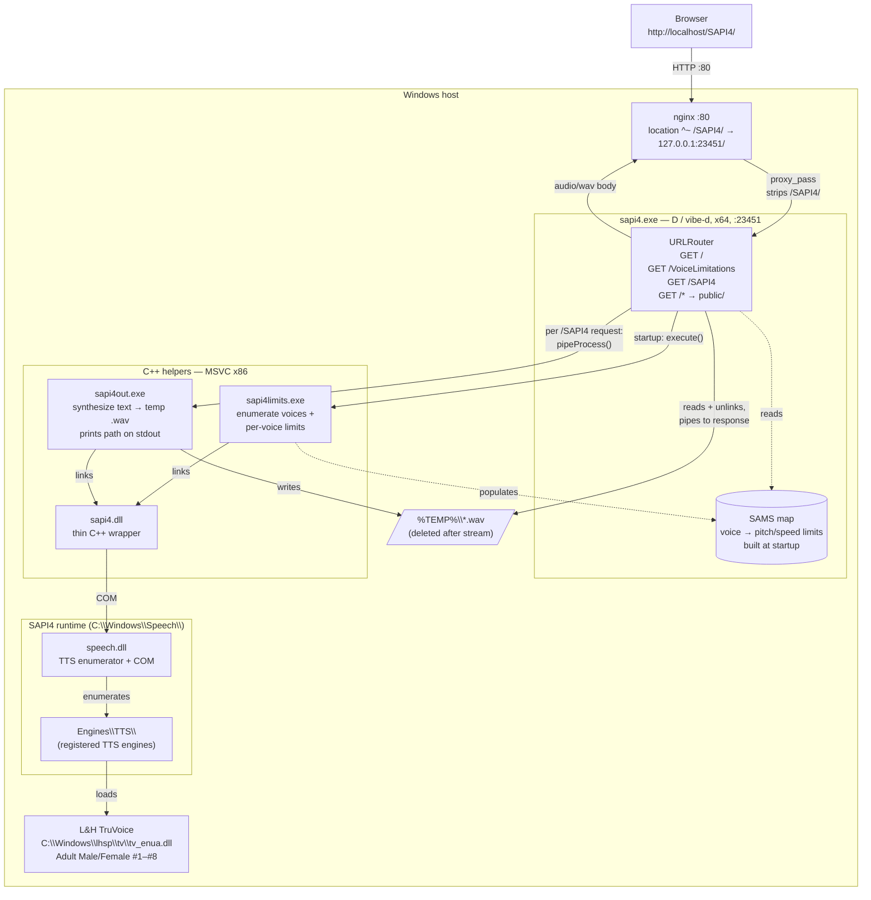

# SAPI4 local setup notes

Bring-up record for getting [Devagram/SAPI4](https://github.com/Devagram/SAPI4) running on this Windows + WSL2 host. The upstream README targets a Windows build machine and a Linux + Wine deploy host; this writeup documents what was actually needed here (Windows-native build, run from a WSL2 shell driving the Windows host via interop).

## Architecture



Key flows:

- **Startup**: `sapi4.exe` runs `sapi4limits.exe` with no args to list voices, then once per voice to fetch pitch/speed ranges, caching the result in `SAMS`.
- **Per request to `/SAPI4`**: validates params against `SAMS`, spawns `sapi4out.exe <voice> <pitch> <speed> <text>` with a 10s watchdog, reads the temp WAV path from its stdout, streams the file to the client, then `removeFile`s it.

## What's running

| Component | Location | Notes |
|---|---|---|
| C++ SAPI4 binaries (`sapi4.dll`, `sapi4out.exe`, `sapi4limits.exe`) | `C:\temp\SAPI4\` | MSVC 2022 Community, x86 |
| D web server (`sapi4.exe`) | `C:\temp\SAPI4\SAPI4_web\sapi4.exe` | ldc2 1.38.0, x86_64 |
| Run directory (all of the above + `public/`, `views/`, openssl DLLs) | `C:\temp\SAPI4\run\` | server CWD |
| SAPI4 runtime DLLs | `C:\Windows\Speech\` | installed by `spchapi.exe` |
| L&H TruVoice TTS engine | `C:\Windows\lhsp\tv\tv_enua.dll` | installed by `tv_enua.exe` |
| nginx reverse proxy | `C:\Users\tomp4\scoop\apps\nginx\current\` | scoop, listens on :80 |

Server endpoints:

- `http://127.0.0.1:23451/` — direct (assets 404 because they assume `/SAPI4/` prefix)
- `http://localhost/SAPI4/` — via nginx, full UI works

API:

- `GET /SAPI4/VoiceLimitations?voice=<voice>` → JSON `{defPitch, minPitch, maxPitch, defSpeed, minSpeed, maxSpeed}`
- `GET /SAPI4/SAPI4?text=<text>&voice=<voice>[&pitch=<n>][&speed=<n>]` → `audio/wav`

## Deviations from the upstream README

1. **`SAPI4_web/dub.json`** — removed `web-config` dependency. It pulls in `std.xml`, which was deprecated in Phobos 2.080 (2018) and removed entirely; modern LDC ships no `std.xml`. The only callsite in `source/app.d` was a dead `if (false) { ... readOption(...) }` block labelled `LEAVE IN THIS BLOCK!!!! OPTLINK SUCKS` — a workaround for OPTLINK (the old DMD linker) that doesn't apply to ldc2. Removed the block too.

2. **`--arch=x86_64`** instead of `--arch=x86` for the D build. The scoop LDC is x64-only and produces x64 import libs; cross-linking x86 with it yields hundreds of LNK2019s. The D server only `execute()`s the SAPI4 .exes as subprocesses, so the architecture of the parent doesn't need to match the (32-bit) children.

3. **`build.bat`** — vcvars32 path patched from `…\2022\Enterprise\…` to `…\2022\Community\…` to match the installed VS edition.

4. **First `spchapi.exe` run from cmd.exe failed silently.** Re-running via `powershell.exe Start-Process -Verb RunAs -Wait` triggered the UAC prompt and installed correctly. Same pattern for `tv_enua.exe`.

5. **nginx on Windows (scoop) instead of Linux+nginx.** The README's `location ^~ /SAPI4/ { proxy_pass http://127.0.0.1:23451/; }` block was added inside the default `server` in `conf/nginx.conf`.

## Build commands

```bat
:: C++ binaries (from C:\temp\SAPI4)
call "C:\Program Files\Microsoft Visual Studio\2022\Community\VC\Auxiliary\Build\vcvars32.bat"
cl sapi4.cpp ole32.lib user32.lib /MT /LD -Ox -I"C:\Program Files (x86)\Microsoft Speech SDK\Include"
cl sapi4out.cpp ole32.lib user32.lib sapi4.lib /MT -Ox -I"C:\Program Files (x86)\Microsoft Speech SDK\Include"
cl sapi4limits.cpp ole32.lib user32.lib sapi4.lib /MT -Ox -I"C:\Program Files (x86)\Microsoft Speech SDK\Include"

:: D web server (from C:\temp\SAPI4\SAPI4_web)
dub --compiler=ldc2 --arch=x86_64 --build=release
```

## Run commands

```bat
:: From C:\temp\SAPI4\run
sapi4.exe                            :: D web server on 127.0.0.1:23451

:: nginx (one-time, elevated for :80)
powershell -Command "Start-Process -FilePath 'C:\Users\tomp4\scoop\apps\nginx\current\nginx.exe' -ArgumentList '-p','C:\Users\tomp4\scoop\apps\nginx\current' -Verb RunAs -WindowStyle Hidden"

:: Stop everything
taskkill /F /IM sapi4.exe /IM nginx.exe
```

## Caveats

- **No Microsoft Sam voice.** The repo's `tv_enua.exe` installs *only* L&H TruVoice (Adult Male/Female #1–#8). Sam comes from a separate Microsoft TTS engine (`mstts.dll`) that's present in `C:\Windows\Speech\` but registers no voices on its own; the actual Sam voice data ships separately (e.g. via Speakonia).
- The TruVoice DLL is 32-bit COM. Spawning `sapi4out.exe` / `sapi4limits.exe` (which we built x86) works; loading TruVoice directly from an x64 process would not.
- The frontend's hard-coded `/SAPI4/` asset prefix means hitting `:23451` directly gives a broken page. Either keep the nginx proxy or rewrite `views/layout.dt` + `public/scripts/tts.js`.
